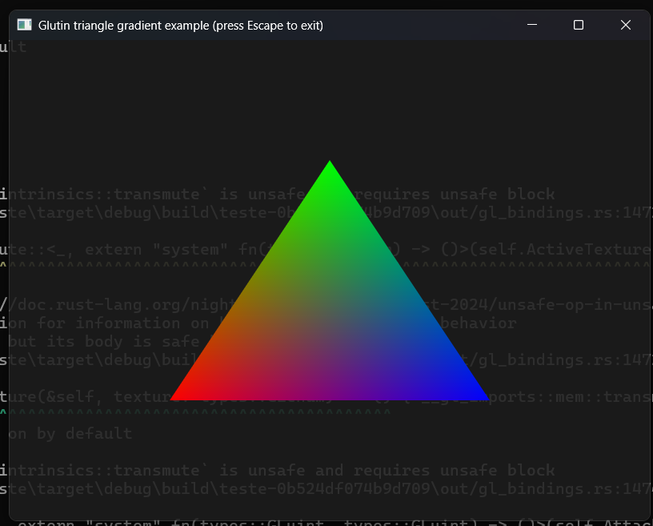
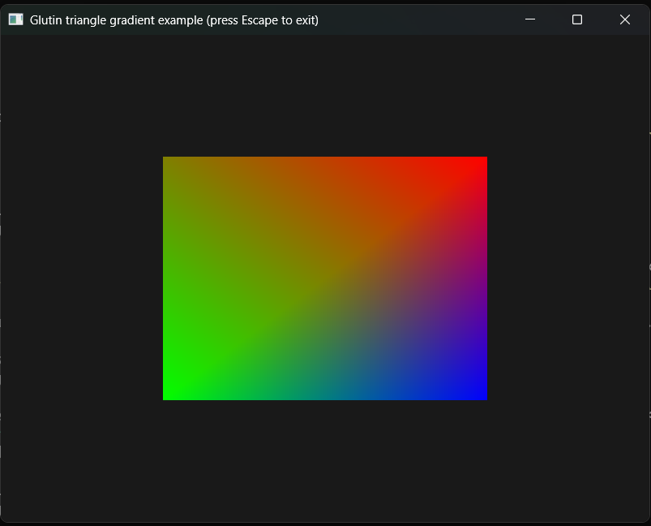
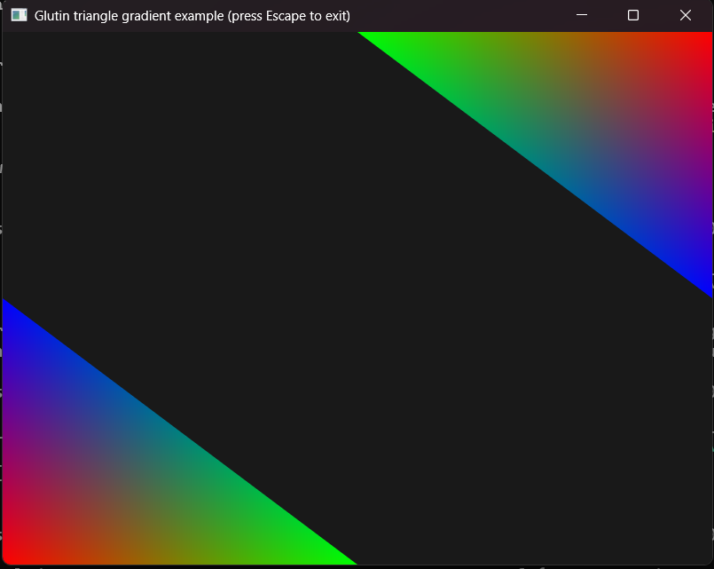

# Rust Graphics Game Test
    
   Projeto feito enquanto não tenho chamados no trabalho. Tem como objetivo criar um pequeno jogo sendo o mais baixo nível possível.
   
   Atualmente conto com o uso do "Winit", como comunicador com a api de janelas do OS, e "Glutin", como gerenciador de contexto Opengl.
   
   Meu objetivo aqui é tentar entender como programar gráficos e como eles funcionam em um baixo nível, é claro que o projeto ainda possuí bibliotecas de abstração, mas o objetivo é tirar elas futuramente.

# DevLog

## Videos

 - https://youtube.com/playlist?list=PLqe3Cbp7qgBD8I-2UTlq2cDyvmoSybPSt&si=vNwHeFgaZeUEaaE2

## 09/07/2025

   Hoje resolvi começar uma DevLog, para anotar o procedimento de desenvolvimento do projeto.
   
   Não fiz muita coisa, apenas consegui terminar um controle das vértices do triângulo vermelho, o que me deu certa dor de cabeça por não ter experiência com o sistema de variáveis do rust.
   
   O programa está assim:

   

## 10/07/2025
    
   Brinquei um pouco tentando fazer um quadrado, primeiro tentei passar do glDrawArrays para o glDrawElements, fato que não consegui realizar, parte por minha ignorancia em opengl, parte por minha preguiça de realmente procurar um guia bem produzido, enfim, o resultado final foi esse:

   

## 14-15/07/2025
   
   Ok, fiz uma abstração no código, criando uma struct de objeto visual (Visual), e implementei um vetor de visuais no renderizador. Isso vai ajudar no futuro pois o código ficou menos engessado e mais dinâmico.

   

## 17/07/2025

   Fiz a movimentação 3D de uma pirâmide, mas não está 100% funcionando, existe algum erro

   1° Versão: *video 1*
   
   2° Versão com alguns erros arrumados: *video 2*

   3° Versão quase 100% certa: *video 3*

## 18/07/2025

   Hoje fiz bastante coisa, esqueci de comentar mas arrumei a "giração" (rotação) da pirâmide ontem em casa, agora ela gira nos 2 eixos yey.
   
   Bem, o trabalho de hoje foi iniciar a programação do player e dos objetos, finalmente criando um "mundo" matematicamente falando, mas por enquanto está só nos números e não implementei praticamente nem o player, nem os objetos. Também dei uma organizada nas pastas.

## 21/07/2025

   Acabei não fazendo log ontem (que foi dia 21), então estou fazendo hoje, aproveitando que não mexi direito no código.
   
   Basicamente, fiz a movimentação relativa do objeto na tela em relação à movimentação da câmera, mas, como tive que diminuir os pontos manualmente (dividindo por 10), eles acabaram girando em torno de um eixo que fica mais pra frente, é como se estivesse em 3° pessoa. Amanhã vou arrumar isso.

## 23/07/2025

   Fiz o W das coordenadas ser dinâmico, e com isso quase todos os meus problemas se resolveram, mas ainda tenho um problema: a pirâmide não gira em torno da câmera, mas sim em torno de um eixo imaginário que fica no espaço da camêra, mas acho que sei como resolver.

## 24-25/07/2025

   Não fiz devlog ontem, mas arrumei a renderização por perspectiva e coloquei a movimentação, inicialmente ela só ia para frente e, para se mover no eixo Z (repare que a camera está alinhada no X), você mexia a câmera para os lados usando as setas e depois se movia para frente.
   
   Ontem também ajeitei os eventos do App e coloquei movimentação da câmera por mouse e do player por WASD. Fiz também um cursor grabber, você pode tirar da tela usando o ESC.

## 28-30/07/2025

   Ok, vou resumir o que eu fiz nesses últimos dias.
   
   Basicamente, nenhuma mudança visual muito expressiva foi feita, na verdade eu passei esses últimos dias organizando o código e preparando para mudanças futuras.
   
   Uma mudança expressiva foi tirar a maioria da parte lógica das Structs responsáveis pela renderização e manejamento da aplicação. Eu basicamente criei uma trait genéria "State", que tem funções que vão manejar todos os inputs e também o update da parte gráfica. Isso é muito bom, pois permite a criação de diversos estados da aplicação com as mais diversas funções sem ter que mexer nas structs principais, tudos está bem abstraido.
   
   Além disso, eu criei arquivos RGL e RGM - Rust Game Level e Rust Game Model respectivamente - que são arquivos que vão armazenar informações dos mapas e dos modelos, fazendo com que eu possa editar ambos sem ter que recompilar o programa toda vez. E isso também prepara o terreno para o futuro modelador e criador de mapas que irá ser implementado na engine. Para ler esses arquivos eu tive que criar um interpretador de uma linguagem super simples que eu acabei criando.
   
   Além do mais, eu organizei melhor a estrutura de arquivos.
