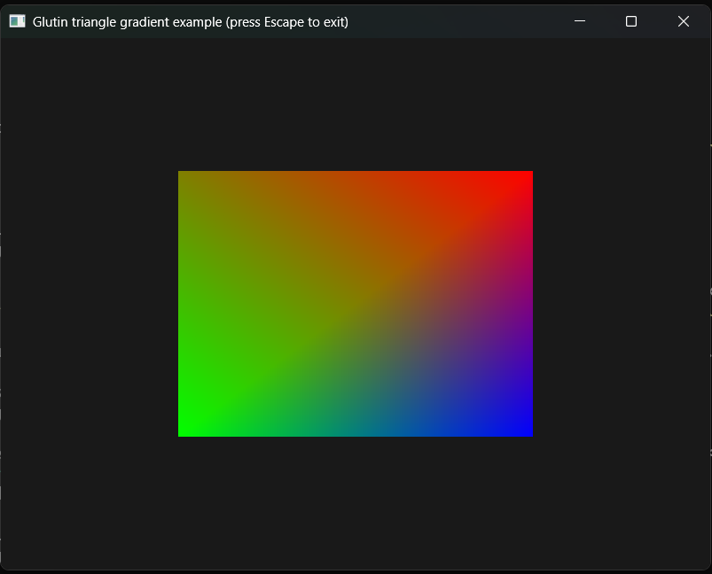

# Rust Graphics Game Test
    
   Projeto feito enquanto não tenho chamados no trabalho. Tem como objetivo criar um pequeno jogo sendo o mais baixo nível possível.
   Atualmente conto com o uso do "Winit", como comunicador com a api de janelas do OS, e "Glutin", como gerenciador de contexto Opengl.
   Meu objetivo aqui é tentar entender como programar gráficos e como eles funcionam em um baixo nível, é claro que o projeto ainda possuí bibliotecas de abstração, mas o objetivo é tirar elas futuramente.

# DevLog

## 09/07/2025

   Hoje resolvi começar uma DevLog, para anotar o procedimento de desenvolvimento do projeto.
   Não fiz muita coisa, apenas consegui terminar um controle das vértices do triângulo vermelho, o que me deu certa dor de cabeça por não ter experiência com o sistema de variáveis do rust.
   O programa está assim:

   

## 10/07/2025
    
   Brinquei um pouco tentando fazer um quadrado, primeiro tentei passar do glDrawArrays para o glDrawElements, fato que não consegui realizar, parte por minha ignorancia em opengl, parte por minha preguiça de realmente procurar um guia bem produzido, enfim, o resultado final foi esse:

   
